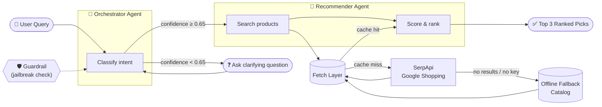

<div align="center">

# 🛍️ Product Finder

### A multi-agent AI shopping assistant that understands what you need — and finds it for you.

*Built on the OpenAI Agents SDK, powered by Gemini, with a live product search pipeline and a transparent, explainable scoring engine.*

[](https://www.python.org/)
[](https://github.com/openai/openai-agents-python)
[](https://ai.google.dev/)
[](https://docs.pydantic.dev/)
[](LICENSE)

[Overview](#-overview) • [How It Works](#-how-it-works) • [Features](#-features) • [Quickstart](#-quickstart) • [Usage](#-usage) • [Architecture](#-architecture) • [Roadmap](#-roadmap)

</div>

---

## 📖 Overview

**Product Finder** is a conversational shopping agent that takes a plain-English request — *"I need wireless headphones under $80"* — and turns it into a ranked, reasoned shortlist of real products.

Instead of one monolithic prompt, it's built as a small team of cooperating AI agents, each with a single job, connected by typed tools and a deterministic scoring layer. The goal isn't just "an LLM that calls an API" — it's a small, well-factored system that shows how to combine **LLM reasoning** with **traditional, auditable code** where correctness actually matters (pricing, ranking, safety).

> 💡 **Why this project matters:** it demonstrates agent orchestration, tool-calling, input guardrails, graceful degradation (live API → cache → offline fallback), and a hand-written ranking algorithm — all in a compact, readable codebase.

---

## 🧠 How It Works



1. **You ask a question in plain English.**
2. The **Orchestrator agent** classifies which product category you mean (Electronics, Fashion, Home & Kitchen, Beauty, or Sports/Outdoors). If it isn't confident, it asks a short clarifying question instead of guessing.
3. Once confident, it **hands off** to the **Recommender agent**.
4. The Recommender calls a **search tool**, which checks an in-memory cache, then queries **SerpApi's Google Shopping** engine, and — if that's unavailable or empty — transparently drops back to a **built-in offline catalog** so the app never dead-ends.
5. Results are passed through a **hand-written scoring algorithm** (not the LLM) that blends relevance, price fit, and budget constraints into a single, explainable `total_score`.
6. You get back **up to 3 ranked products**, each with a one-line reason it was picked.

Every user message also passes through an **input guardrail agent** that screens for prompt-injection / jailbreak attempts before the orchestrator ever sees it.

---

## ✨ Features

| | |
|---|---|
| 🤖 **Multi-agent orchestration** | Two specialized agents (Orchestrator + Recommender) hand off control based on classification confidence, instead of one agent trying to do everything. |
| 🎯 **Confidence-gated classification** | Ambiguous queries trigger a clarifying question instead of a wrong guess — the agent knows when it doesn't know. |
| 🛡️ **Input guardrails** | A dedicated guardrail agent screens every message for jailbreak / prompt-injection attempts before it reaches the orchestrator. |
| 🔎 **Live product search** | Real-time results via **SerpApi's Google Shopping** engine. |
| 🗄️ **Resilient fetch pipeline** | Cache → Live API → Offline fallback catalog, so the assistant always has *something* useful to say, even with no API key or a network hiccup. |
| 📊 **Explainable scoring engine** | A deterministic, code-based ranking algorithm — not an LLM guess — combining relevance, price positioning, budget detection (`"under $100"`), median-price closeness, and a trusted-retailer bonus. |
| 💬 **Streaming CLI** | Token-by-token streamed responses, with live `[calling tool_name]` and `[handoff → agent]` events so you can see the agent think. |
| 🧵 **Persistent sessions** | Conversation history is stored in SQLite (`SQLiteSession`), so context carries across turns and survives restarts. |
| 🧩 **Fully typed data contracts** | Every object crossing an agent/tool boundary is a validated **Pydantic** model (`Product`, `ScoredProduct`, `ClassifiedQuery`). |

---

## 🏗️ Architecture

```
Product_Finder/
├── cli.py                     # Streaming CLI entry point (session mgmt, event loop)
├── models.py                  # LLM client config (Gemini via OpenAI-compatible endpoint)
├── guardrails.py               # Jailbreak / prompt-injection input guardrail
├── schema.py                  # Pydantic data contracts (Product, ScoredProduct, ...)
│
├── core_agents/
│   ├── orchestrator.py        # Intent classification + handoff logic
│   └── recommender.py         # Search + scoring + response formatting
│
├── tools/
│   ├── classify.py            # Keyword-based category classifier (function_tool)
│   ├── search.py              # Product search tool (function_tool)
│   └── scoring.py             # Relevance / price / budget scoring algorithm
│
└── services/
    ├── fetch_layer.py         # Cache-first product fetch orchestration
    ├── serpapi_client.py      # Google Shopping integration via SerpApi
    ├── fallback_data.py       # Offline demo catalog (5 categories)
    └── cache.py                # Lightweight in-memory cache
```

**Two agents, two models.** The Orchestrator runs on a fast, cheap model (`gemini-2.5-flash`) since classification is a lightweight task; the Recommender runs on a stronger model tier since presenting ranked recommendations well benefits from better reasoning. Both are wired through a single OpenAI-compatible client pointed at Gemini's API, so swapping providers later is a one-line change.

**Scoring is not left to the LLM.** `tools/scoring.py` computes everything in code: it detects an explicit budget (`"under $100"`), filters out unrealistic outliers, and blends relevance / price-fit / median-closeness / retailer-trust into a transparent `total_score` — every number is reproducible and auditable, not a model's vibes.

---

## 🧰 Tech Stack

- **[OpenAI Agents SDK](https://github.com/openai/openai-agents-python)** — agent orchestration, handoffs, guardrails, tracing, streaming
- **Google Gemini** (`2.5-flash` / `3.5-flash`) — via an OpenAI-compatible endpoint
- **Pydantic v2** — typed schemas and runtime validation for every tool boundary
- **SerpApi** — real-time Google Shopping results
- **httpx** — async HTTP client for external API calls
- **SQLite** — persistent conversation sessions
- **uv** — dependency & environment management

---

## 🚀 Quickstart

### Prerequisites
- Python 3.12+
- A [Gemini API key](https://ai.google.dev/) (required)
- A [SerpApi key](https://serpapi.com/) (optional — enables live search; the app runs on fallback data without it)

### 1. Clone & install

```bash
git clone https://github.com/mr-shaheer/Product_Finder.git
cd Product_Finder

# using uv (recommended)
uv sync

# or with pip
pip install -e .
```

### 2. Configure environment

```bash
cp .env.example .env
```

```ini
GEMINI_API_KEY=your_gemini_key_here
SERPAPI_KEY=your_serpapi_key_here      # optional — enables live product search
OPENAI_API_KEY=your_openai_key_here    # optional — enables tracing
```

### 3. Run it

```bash
python cli.py
# or: uv run cli.py
```

---

## 💬 Usage

```
Product Finder CLI, type /reset to start over & /exit to quit
You: I need wireless headphones under $80

  [calling classify_query]
Assistant:
  [handoff → recommender]
  [calling search_products]
  [calling normalize_and_score]

- **Wireless Bluetooth Headphones** — $79.99: Strong keyword match and fits comfortably within your budget.
- **USB-C Charging Hub 7-in-1** — $34.99: Well under budget, solid alternative if you're open to related accessories.

You: /exit
```

- Type `/reset` at any point to clear the active agent and start a fresh conversation.
- Type `/exit` to quit.
- Low-confidence queries (e.g. *"something for my kitchen"*) trigger a clarifying question instead of a guess.

---

## 🗺️ Roadmap

- [ ] Web UI (FastAPI + simple frontend) alongside the CLI
- [ ] Add more product categories and retailers
- [ ] Persist scoring weights as configurable presets ("budget-first", "quality-first")
- [ ] Automated test suite for the scoring algorithm and guardrails
- [ ] Multi-turn preference memory (remembers brand/style preferences across sessions)

---

## 🤝 Contributing

Contributions, issues, and feature requests are welcome — feel free to check the [issues page](https://github.com/mr-shaheer/Product_Finder/issues).

## 📄 License

Distributed under the **MIT License**. See [`LICENSE`](LICENSE) for details.

---

<div align="center">

### 👤 Author

**Muhammad Shaheer**

[](https://github.com/mr-shaheer)

*If this project was interesting to explore, a ⭐ on the repo goes a long way!*

</div>
