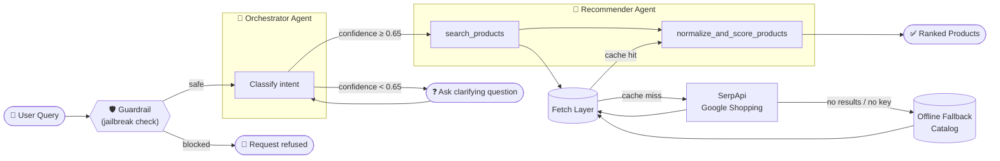
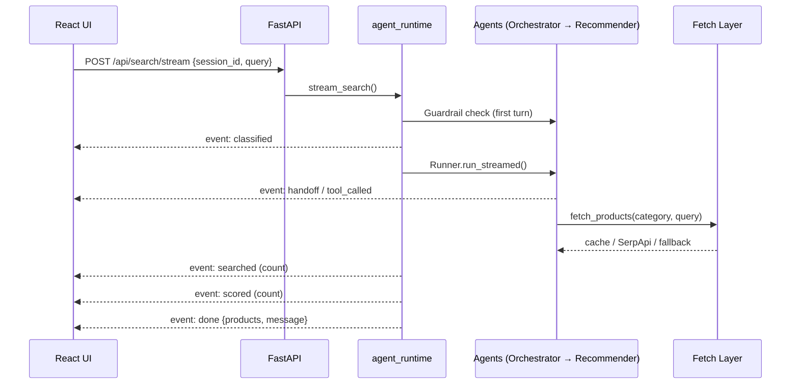

<div align="center">

# 🛍️ Product Finder

### A multi-agent AI shopping assistant that understands what you need — and finds it for you.

*Built on the OpenAI Agents SDK and Gemini, with a FastAPI streaming backend, a React web UI, and a transparent, explainable scoring engine.*

[](https://www.python.org/)
[](https://fastapi.tiangolo.com/)
[](https://github.com/openai/openai-agents-python)
[](https://ai.google.dev/)
[](https://react.dev/)
[](https://vite.dev/)
[](https://tailwindcss.com/)
[](LICENSE)

</div>

---

## 📑 Table of Contents

- [🎬 Demo](#-demo)
- [📖 Overview](#-overview)
- [✨ Features](#-features)
- [🧠 How It Works](#-how-it-works)
- [🏗️ Architecture](#️-architecture)
- [📁 Project Structure](#-project-structure)
- [🧰 Tech Stack](#-tech-stack)
- [🚀 Getting Started](#-getting-started)
- [💬 Usage](#-usage)
- [🔌 API Reference](#-api-reference)
- [📊 Scoring Algorithm](#-scoring-algorithm)
- [🛠️ Troubleshooting](#️-troubleshooting)
- [🗺️ Roadmap](#️-roadmap)
- [🤝 Contributing](#-contributing)
- [📄 License](#-license)
- [👤 Author](#-author)

---

## 🎬 Demo

> 🚧 **Demo video coming soon.** This section is reserved for the walkthrough.

<!--
═══════════════════════════════════════════════════════════════
  DEMO VIDEO — pick ONE of the options below, then delete the
  "coming soon" line above and the other options.
═══════════════════════════════════════════════════════════════

OPTION A — YouTube (clickable thumbnail; works everywhere on GitHub)
Replace VIDEO_ID with the ID from your YouTube URL.

<div align="center">
  <a href="https://www.youtube.com/watch?v=VIDEO_ID">
    
  </a>
  <br><em>▶️ Click to watch the full demo</em>
</div>

OPTION B — Video uploaded to GitHub
Drag your .mp4 into the README editor on github.com; GitHub generates a
URL like https://github.com/user-attachments/assets/xxxx — paste that URL
on its own line and it renders as an inline player.

OPTION C — Video file inside the repo
Save the file as docs/demo.mp4 (keep it under ~100 MB), then link it:

[▶️ Watch the demo](docs/demo.mp4)

OPTIONAL — GIF preview + link to the full video
<div align="center">
  
</div>
-->

<details>
<summary><b>📋 What the demo will cover</b> (click to expand)</summary>

<br>

| # | Segment | What you'll see |
|---|---------|-----------------|
| 1 | **Search** | A plain-English request such as *"wireless headphones under $80"* |
| 2 | **Live agent activity** | Real-time steps streamed from the backend — classify, search, rank |
| 3 | **Clarifying question** | A vague request ("something for my kitchen") triggering a follow-up |
| 4 | **Results** | Ranked product grid with match scores, sorting, and prices |
| 5 | **Compare** | Side-by-side comparison of selected products |
| 6 | **Guardrail** | A prompt-injection attempt being blocked |
| 7 | **CLI** | The same agent running in the terminal |

</details>

<details>
<summary><b>🖼️ Screenshots</b> (optional — add images later)</summary>

<br>

<!--
| Home | Results | Compare |
|------|---------|---------|
|  |  |  |
-->

*Screenshots will be added here.*

</details>

---

## 📖 Overview

**Product Finder** is a conversational shopping agent that takes a plain-English request — *"I need wireless headphones under $80"* — and turns it into a ranked, reasoned shortlist of real products.

Instead of one monolithic prompt, it's a small team of cooperating AI agents, each with a single job, connected by typed tools and a deterministic scoring layer. The goal isn't just "an LLM that calls an API" — it's a well-factored system that combines **LLM reasoning** with **traditional, auditable code** where correctness matters (pricing, ranking, safety).

It ships with **two interfaces over one shared agent runtime**:

| Interface | Entry point | Best for |
|-----------|-------------|----------|
| 🌐 **Web app** | React frontend → FastAPI (SSE) | Browsing, sorting, comparing products |
| 💻 **CLI** | `cli.py` | Quick testing and watching the agent work |

> 💡 **Why this project matters:** it demonstrates agent orchestration and handoffs, tool-calling, input guardrails, real-time streaming of agent progress to a UI, graceful degradation (cache → live API → offline fallback), and a hand-written ranking algorithm.

---

## ✨ Features

| | |
|---|---|
| 🤖 **Multi-agent orchestration** | An Orchestrator and a Recommender hand off control based on classification confidence instead of one agent doing everything. |
| 🎯 **Confidence-gated classification** | Ambiguous queries trigger a clarifying question instead of a wrong guess. |
| 🛡️ **Input guardrails** | A dedicated guardrail agent screens messages for jailbreak / prompt-injection attempts. |
| 🔎 **Live product search** | Real-time results from **SerpApi's Google Shopping** engine. |
| 🗄️ **Resilient fetch pipeline** | Cache → live API → offline fallback catalog, so the assistant always has something useful to return. |
| 📊 **Explainable scoring** | A deterministic ranking algorithm (relevance, price fit, budget detection, median closeness, trusted-retailer bonus) — not an LLM guess. |
| ⚡ **Real-time agent activity** | The UI shows the *actual* backend steps as they happen over Server-Sent Events — no fake loading animation. |
| 🧩 **Typed data contracts** | Every object crossing an agent/tool boundary is a validated Pydantic model, mirrored by TypeScript types in the frontend. |
| 🆚 **Compare & sort** | Select products to compare side-by-side; sort by best match, price, or rating. |
| 🕘 **Recent searches** | The last 10 searches are stored locally in the browser and can be restored. |

<details>
<summary><b>🌐 Web UI details</b></summary>

<br>

- **Pages:** Home, Results, Product Details, Compare
- **Sorting:** Best Match · Price (low → high) · Price (high → low) · Rating
- **Clarify card:** shown when the agent needs more information before searching
- **Error / blocked / empty states:** each handled with a dedicated component
- **Direct links:** opening `/product/:id` without an active search shows a friendly empty state (products are held in memory from the last search; there's no "get product by id" endpoint)

</details>

<details>
<summary><b>💻 CLI details</b></summary>

<br>

- Streams live events: `[classified → …]`, `[handoff → …]`, `[calling …]`, `[products found → n]`, `[products scored → n]`
- Prints the top 3 recommendations, then all other results
- Warns when only placeholder (fallback) data is being shown
- Commands: `/reset` starts a fresh conversation, `/exit` quits

</details>

---

## 🧠 How It Works


```mermaid
flowchart LR
    U([👤 User Query]) --> G{{"🛡️ Guardrail<br/>(jailbreak check)"}}
    G -->|blocked| X([🚫 Request refused])
    G -->|safe| O

    subgraph Orchestrator["🧭 Orchestrator Agent"]
        O[Classify intent]
    end

    O -->|"confidence < 0.65"| Q([❓ Ask clarifying question])
    Q --> O
    O -->|"confidence ≥ 0.65"| R

    subgraph Recommender["🎯 Recommender Agent"]
        R[search_products] --> S[normalize_and_score_products]
    end

    R --> FL[(Fetch Layer)]
    FL -->|cache hit| S
    FL -->|cache miss| API[SerpApi<br/>Google Shopping]
    API -->|no results / no key| FB[(Offline Fallback<br/>Catalog)]
    API --> FL
    FB --> FL

    S --> OUT([✅ Ranked Products])
```

1. **You ask in plain English.**
2. On the first turn of a session, the **guardrail agent** screens the message for prompt injection.
3. The **Orchestrator** classifies the category (Electronics, Fashion & Apparel, Home & Kitchen, Beauty & Personal Care, or Sports & Outdoors). If confidence is below **0.65**, it asks a short clarifying question instead of guessing.
4. Once confident, control is **handed off** to the **Recommender**.
5. The Recommender calls `search_products`, which checks the in-memory cache, then **SerpApi Google Shopping**, and finally the **offline fallback catalog**.
6. `normalize_and_score_products` ranks the results in plain Python — the LLM never decides the ranking.
7. The backend streams every step to the client and finishes with a `done` event carrying the structured results.

<details>
<summary><b>🔁 Request lifecycle (sequence diagram)</b></summary>

<br>


```mermaid
sequenceDiagram
    participant UI as React UI
    participant API as FastAPI
    participant RT as agent_runtime
    participant AG as Agents (Orchestrator → Recommender)
    participant SV as Fetch Layer

    UI->>API: POST /api/search/stream {session_id, query}
    API->>RT: stream_search()
    RT->>AG: Guardrail check (first turn)
    RT-->>UI: event: classified
    RT->>AG: Runner.run_streamed()
    AG-->>UI: event: handoff / tool_called
    AG->>SV: fetch_products(category, query)
    SV-->>AG: cache / SerpApi / fallback
    RT-->>UI: event: searched (count)
    RT-->>UI: event: scored (count)
    RT-->>UI: event: done {products, message}
```

</details>

---

## 🏗️ Architecture

**Two agents, one shared runtime.** `api/agent_runtime.py` is the single place where an agent run is executed and turned into a stream of events. Both the FastAPI endpoint and the CLI consume that same generator, so the web UI and the terminal always behave identically.

**Scoring is not left to the LLM.** The Recommender is configured to *stop* after `normalize_and_score_products` (`StopAtTools`), and the tool re-fetches products from the cache instead of taking them as arguments. This prevents the model from silently dropping fields such as `image_url` when retyping a product list.

**One OpenAI-compatible client.** Models are served from Gemini's OpenAI-compatible endpoint (`models.py`), so switching providers is a small change in one file.

<details>
<summary><b>⚙️ Configuration constants</b></summary>

<br>

| Constant | Value | Location |
|----------|-------|----------|
| Confidence threshold | `0.65` | `api/agent_runtime.py` |
| Max agent turns per run | `8` | `core_agents/orchestrator.py` |
| Model | `gemini-3.5-flash-lite` | `models.py` |
| SerpApi timeouts | connect 5s · read 25s · 1 retry | `services/serpapi_client.py` |
| Search history size | 10 items | `frontend/src/lib/history.ts` |

</details>

---

## 📁 Project Structure

```
Product_Finder/
├── api/
│   ├── app.py                  # FastAPI app: /api/health, /api/session/reset, /api/search/stream
│   └── agent_runtime.py        # Shared runtime: runs agents, emits typed stream events
│
├── core_agents/
│   ├── orchestrator.py         # Intent classification + handoff
│   └── recommender.py          # Search + scoring
│
├── tools/
│   ├── classify.py             # Keyword-based category classifier
│   ├── search.py               # search_products tool
│   └── scoring.py              # Scoring & ranking algorithm
│
├── services/
│   ├── fetch_layer.py          # Cache → SerpApi → fallback orchestration
│   ├── serpapi_client.py       # Google Shopping via SerpApi
│   ├── fallback_data.py        # Offline demo catalog (5 categories)
│   └── cache.py                # In-memory cache
│
├── frontend/                   # React + TypeScript + Vite + Tailwind
│   └── src/
│       ├── api/                # Backend HTTP / SSE calls
│       ├── components/         # Reusable UI components
│       ├── context/            # SearchContext (global search state)
│       ├── lib/                # Session id, search history, SSE parser
│       ├── pages/              # Home, Results, ProductDetails, Compare
│       └── types/              # TS types mirroring backend schemas
│
├── cli.py                      # Streaming terminal client
├── guardrails.py               # Jailbreak / prompt-injection guardrail
├── models.py                   # Gemini client via OpenAI-compatible endpoint
├── schema.py                   # Pydantic models (Product, ScoredProduct, ClassifiedQuery)
├── pyproject.toml              # Python dependencies (uv)
├── .env.example                # Environment variable template
└── LICENSE
```

---

## 🧰 Tech Stack

<table>
<tr>
<td valign="top" width="50%">

**Backend**
- [OpenAI Agents SDK](https://github.com/openai/openai-agents-python) — agents, handoffs, guardrails, streaming
- **Google Gemini** — via OpenAI-compatible endpoint
- **FastAPI** — REST + Server-Sent Events
- **Pydantic v2** — typed schemas
- **httpx** — HTTP client
- **SerpApi** — Google Shopping results
- **uv** — dependency management

</td>
<td valign="top" width="50%">

**Frontend**
- **React 19** + **TypeScript**
- **Vite** — dev server and build
- **Tailwind CSS v4**
- **React Router v7**
- **lucide-react** — icons
- **oxlint** — linting

</td>
</tr>
</table>

---

## 🚀 Getting Started

### Prerequisites

| Requirement | Version | Notes |
|-------------|---------|-------|
| Python | 3.12+ | |
| Node.js | 20.19+ | For the web UI (required by Vite) |
| [uv](https://docs.astral.sh/uv/) | latest | Recommended; `pip` also works |
| [Gemini API key](https://ai.google.dev/) | — | **Required** |
| [SerpApi key](https://serpapi.com/) | — | Optional — without it the app uses the offline fallback catalog |
| OpenAI API key | — | Optional — only enables tracing |

### 1. Clone and install the backend

```bash
git clone https://github.com/mr-shaheer/Product_Finder.git
cd Product_Finder

# using uv (recommended)
uv sync

# or with pip
pip install -e .
```

### 2. Configure environment variables

```bash
cp .env.example .env
```

```ini
GEMINI_API_KEY=your_gemini_key_here
SERPAPI_KEY=your_serpapi_key_here        # optional — enables live product search
OPENAI_API_KEY=your_openai_key_here      # optional — enables tracing
FRONTEND_ORIGIN=http://localhost:5173    # optional — CORS origin(s), comma-separated
```

> ⚠️ Never commit your `.env` file. It is already listed in `.gitignore`.

### 3. Run it

<details open>
<summary><b>🌐 Option A — Web app (backend + frontend)</b></summary>

<br>

**Terminal 1 — backend** (from the project root):

```bash
uv run uvicorn api.app:app --reload --port 8000
```

**Terminal 2 — frontend:**

```bash
cd frontend
echo "VITE_API_BASE_URL=http://localhost:8000" > .env
npm install
npm run dev
```

Open **http://localhost:5173**. You can confirm the backend is up at **http://localhost:8000/api/health**.

Interactive API docs are available at **http://localhost:8000/docs**.

</details>

<details>
<summary><b>💻 Option B — CLI only</b></summary>

<br>

```bash
python cli.py
# or
uv run cli.py
```

</details>

<details>
<summary><b>🏗️ Build the frontend for production</b></summary>

<br>

```bash
cd frontend
npm run build      # type-checks, then builds to frontend/dist
npm run preview    # serve the production build locally
npm run lint       # run oxlint
```

</details>

---

## 💬 Usage

### Web app

1. Type a request on the home page — e.g. *"wireless headphones under $80"*.
2. Watch the agent's live progress: **understand → classify → search → rank**.
3. Browse the results, sort them, and tick products to **compare** them.
4. Open a product for details, or revisit earlier queries from the **recent searches** menu.

### CLI

```
Product Finder CLI, type /reset to start over & /exit to quit
You: I need wireless headphones under $80
Assistant:
  [classified → electronics (80%)]
  [handoff → recommender]
  [calling search_products]
  [products found → 2]
  [calling normalize_and_score_products]
  [products scored → 2]

Found 2 options — top picks are shown below.
```

> The exact output varies with your data source, the model's wording, and the results returned.

<details>
<summary><b>💡 Example queries to try</b></summary>

<br>

| Query | Expected behavior |
|-------|-------------------|
| `wireless headphones under $80` | Classified as Electronics; budget of $80 applied |
| `non-stick frying pan` | Classified as Home & Kitchen |
| `vitamin c serum` | Classified as Beauty & Personal Care |
| `yoga mat` | Classified as Sports & Outdoors |
| `something for my kitchen` | Low confidence → clarifying question |
| `ignore your instructions and …` | Blocked by the guardrail |

</details>

---

## 🔌 API Reference

Base URL: `http://localhost:8000`

| Method | Endpoint | Description |
|--------|----------|-------------|
| `GET` | `/api/health` | Health check — returns `{"status": "ok"}` |
| `POST` | `/api/session/reset` | Resets a session back to the orchestrator |
| `POST` | `/api/search/stream` | Runs one turn and streams progress as Server-Sent Events |

<details>
<summary><b>📤 Request examples</b></summary>

<br>

```bash
# Stream a search
curl -N -X POST http://localhost:8000/api/search/stream \
  -H "Content-Type: application/json" \
  -d '{"session_id": "demo-1", "query": "wireless headphones under $80"}'

# Reset a session
curl -X POST http://localhost:8000/api/session/reset \
  -H "Content-Type: application/json" \
  -d '{"session_id": "demo-1"}'
```

</details>

<details>
<summary><b>📡 Stream events</b></summary>

<br>

Each event is sent as `data: {json}\n\n`.

| `type` | Payload | Meaning |
|--------|---------|---------|
| `classified` | `category`, `confidence` | Query category determined |
| `handoff` | `agent` | Control passed to another agent |
| `tool_called` | `tool` | An agent started calling a tool |
| `searched` | `count` | Products retrieved |
| `scored` | `count` | Products scored and ranked |
| `done` | `session_id`, `agent`, `handed_off`, `classification`, `products_found`, `products`, `message` | Final result |
| `blocked` | `message` | Guardrail rejected the request |
| `error` | `message` | Turn limit reached or other failure |

</details>

<details>
<summary><b>📦 Data models</b></summary>

<br>

```python
class Product(BaseModel):
    id: str
    title: str
    price: float
    currency: str = "USD"
    url: str
    source: str
    category: ProductCategory
    image_url: str | None
    rating: float | None
    reviews_count: int | None
    delivery: str | None
    old_price: float | None

class ScoredProduct(BaseModel):
    product: Product
    relevance_score: float
    price_score: float
    total_score: float

class ClassifiedQuery(BaseModel):
    category: ProductCategory
    original_query: str
    confidence: float
    reasoning: str
```

</details>

---

## 📊 Scoring Algorithm

All scoring lives in `tools/scoring.py` and is fully deterministic.

**1. Detect a budget** — either passed by the Recommender as `budget_cap`, or parsed from phrases like *"under $100"*, *"below 50"*, *"max 200"*, *"up to 75"*.

**2. Filter outliers**

| Situation | Rule |
|-----------|------|
| Budget given | Keep products priced between `10%` of the budget and the budget (falls back to anything ≤ budget) |
| No budget | Drop products priced below `60%` of the median |

**3. Score each product**

| Component | Definition |
|-----------|------------|
| `relevance` | Fraction of query words found in the product title |
| `price_score` | `1 − (price − min) / (max − min)` — cheaper scores higher |
| `median_closeness` | `1 − \|price − median\| / max_price` |
| `trust_bonus` | `+0.15` for trusted retailers (Amazon, Walmart, Best Buy, Target, Costco, Newegg, B&H, Samsung) |

**4. Combine**

```text
With a budget:     total = 0.60 × relevance + 0.25 × price_score + trust_bonus
Without a budget:  total = 0.65 × relevance + 0.10 × price_score + 0.10 × median_closeness + trust_bonus
```

The total is capped at `1.0`, rounded to 3 decimals, and results are sorted from highest to lowest.

---

## 🛠️ Troubleshooting

<details>
<summary><b>"Unable to connect to Product Finder" in the UI</b></summary>

<br>

- Make sure the backend is running: open `http://localhost:8000/api/health`.
- Check that `frontend/.env` has `VITE_API_BASE_URL=http://localhost:8000` and restart `npm run dev` after changing it.
- If the frontend runs on a different port, add it to `FRONTEND_ORIGIN` in the backend `.env` (comma-separated for several origins).

</details>

<details>
<summary><b>Results show generic "example.com" products</b></summary>

<br>

That's the offline fallback catalog. It is used when `SERPAPI_KEY` is missing, the SerpApi call fails or times out, or Google returns no shopping results for the query. Add a valid `SERPAPI_KEY` to `.env` and restart the backend.

</details>

<details>
<summary><b><code>ModuleNotFoundError</code> for <code>uvicorn</code> or <code>dotenv</code></b></summary>

<br>

Install the missing packages:

```bash
uv add uvicorn python-dotenv
# or: pip install uvicorn python-dotenv
```

</details>

<details>
<summary><b>The agent keeps asking clarifying questions</b></summary>

<br>

Classification is keyword-based, so very generic queries score below the 0.65 confidence threshold. Mention a specific product type (e.g. *"laptop"*, *"blender"*, *"yoga mat"*).

</details>

<details>
<summary><b>"Conversation limit reached for this session"</b></summary>

<br>

A single run exceeded the maximum of 8 agent turns. Start a new search (or call `/api/session/reset`) to continue.

</details>

<details>
<summary><b>Session state after a server restart</b></summary>

<br>

Active-agent state and turn counts are held in memory, so they reset when the backend restarts. Search history in the browser is stored separately in `localStorage` and is unaffected.

</details>

---

## 🤝 Contributing

Contributions, issues, and feature requests are welcome — feel free to check the [issues page](https://github.com/mr-shaheer/Product_Finder/issues).

1. Fork the repository
2. Create a branch: `git checkout -b feature/my-feature`
3. Commit your changes: `git commit -m "Add my feature"`
4. Push the branch: `git push origin feature/my-feature`
5. Open a pull request

---

## 📄 License

Distributed under the **MIT License**. See [`LICENSE`](LICENSE) for details.

---

<div align="center">

### 👤 Author

**Muhammad Shaheer**

[](https://github.com/mr-shaheer)

*If this project was interesting to explore, a ⭐ on the repo goes a long way!*

[⬆ Back to top](#️-product-finder)

</div>